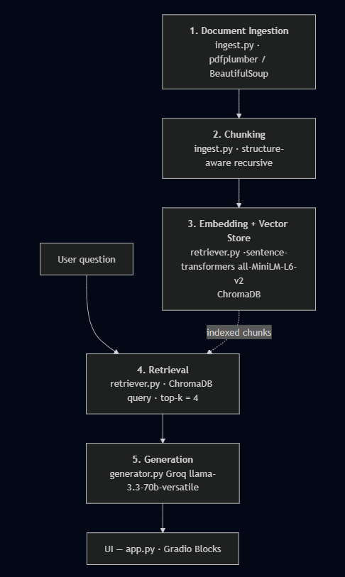

# Project 1 Planning: The Unofficial Guide
---

## Domain

<!-- What domain did you choose? Why is this knowledge valuable and hard to find through official channels? -->
The domain of knowledge this system will cover is UCONN Storrs on-campus housing information. This knowledge is not typically easily accessible because it is fragmentted in various location and some information is stored in long contracts that are difficult to read. Furthermore, student's opinions are not published by the university and must be obtained from other sources. This includes qualititative information that would not be reported by the university like quietness, comfort, cleanliness, etc.  

---

## Documents

<!-- List your specific sources: URLs, subreddit names, forum threads, or file descriptions.
     Aim for at least 10 sources that together cover different subtopics or perspectives within your domain. -->

| # | Source | Type | URL or file path |
|---|--------|------|-----------------|
| 1 |UCONN Housing Contract | PDF |https://campushousing.media.uconn.edu/wp-content/uploads/sites/3384/2026/05/2026-2027-Housing-Contract-draft-4.29.26.pdf |
| 2 |UCONN Room Rates |Website |https://campushousing.uconn.edu/manage-housing/room-rates/ |
| 3 |UCONN Resident Requirements | Website |https://campushousing.uconn.edu/living-on-campus/policies/residency-requirement-information/ |
| 4 | RateMyDorm Dorm Rankings 1|Website |https://www.ratemydorm.com/dorms-ranked/university-of-connecticut |
| 5 |Prked Dorm Rankings 2  |Website |https://prked.com/post/best-university-of-connecticut-dorms |
| 6 |UCONN Housing FAQ |Website |https://campushousing.uconn.edu/frequently-asked-questions/ |
| 7 |UCONN Housing Dates |Website |https://campushousing.uconn.edu/manage-housing/important-dates/ |
| 8 |Unoffical Dorm Guide |PDF | https://docs.google.com/document/d/1CXZzsvqpiB5_siL-akbl4KZ99m9aTGLSgaLiTpVDjRk/edit?tab=t.0|
| 9 |UCONN Amenities by Area|Website |https://campushousing.uconn.edu/living-on-campus/amenities-by-area/ |
| 10 |UCONN Dorm Key and Card Access |Website |https://campushousing.uconn.edu/keys-and-card-access/ |

---

## Chunking Strategy

<!-- How will you split documents into chunks?
     State your chunk size (in tokens or characters), overlap size, and explain why those
     numbers fit the structure of your documents.
     A review-heavy corpus warrants different chunking than a long FAQ. -->
Documents are processed according to type. 
- PDF (_read_pdf) — extracted page-by-page with pdfplumber; pages with no text are skipped.
- HTML (_read_html) — parsed with BeautifulSoup; script, style, noscript, nav, header, footer, aside, form, button, svg, iframe are removed, then text is pulled from the "main → article → body container," so site menus, scripts, and boilerplate are stripped and only article text remains.
- TXT — read as-is.

Then the extra white space is removed and chunks are created recursively. After whitespace cleanup, documents are split into blocks using blank lines and heading boundaries. The chunker uses a structure-aware recursive strategy: small neighboring blocks are grouped together up to a target size of about 400 characters, while larger blocks are preserved when possible up to a maximum size of about 800 characters. Blocks exceeding the maximum size are split on sentence boundaries, with a 60-character overlap carried into the next chunk and adjusted to the nearest word. Very short chunks are dropped using a minimum chunk-length threshold of 100 characters. A recursive section based chunking strategy is chosen beacuse each document is split into different sections that are mostly self-contained. The housing contract in particular is neatly split into many sections. The character counts were chosen because they seemed to embody an idea neatly without becoming too long. The overlap is used in case a given piece of information stretches across multiple chunks for long sections, but is kept relatively small to keep th

**Chunk size:** 100-800 characters

**Overlap:** 80 characters

---

## Retrieval Approach

<!-- Which embedding model are you using (e.g., all-MiniLM-L6-v2 via sentence-transformers)?
     How many chunks will you retrieve per query (top-k)?
     If you were deploying this for real users and cost wasn't a constraint, what tradeoffs
     would you weigh in choosing a different embedding model — context length, multilingual
     support, accuracy on domain-specific text, latency? -->

**Model used:** all-MiniLM-L6-v2 via sentence-transformers

**Top-k:** 4

**Production tradeoff reflection:**
Pros: Small and Fast, Local with no server calls, No API costs
Cons: Lower accuracy/performance, Only English, Small context window 

**Decisions:** 
I retrieve 4 chunks per query (N_RESULTS = 4). With a 400-char target chunk size, 4 chunks gives the LLM enough grounded context cover a multi-part answer or pull a definition plus the rule that uses it, without flooding the prompt distantly related information. 
If I were deploying this system for real users and costs were not a concern, I would likely prefer larger models that would be more reliable and hosted on a server over lightweight models hosted locally. In exchange there would be some network latency for requests and server costs. This would be less private, but these documents are all public information, so that is not as much of a concern. Furthermore, the token limit on the model influenced my chunk sizing. With a different model, it may be beneficial to make larger chunks for long sections (for example in the housing contract). Another limitation of this model is that it only works for English, which isn't a major concern but is worth noting.  

---

## Evaluation Plan

<!-- List your 5 test questions with their expected correct answers.
     Questions should be specific enough that you can judge whether the system's response
     is right or wrong. "What are good dining halls?" is too vague.
     "What do students say about wait times at [dining hall name] during lunch?" is testable. -->

| # | Question | Expected answer |
|---|----------|-----------------|
| 1 | Are pets allowed in the dorm? | Pets are not allowed except for service animals and aquarium fish.|
| 2 |What amenities does Buckley have?   | Bed, desk, chair, game room, etc.|
| 3 |What do students say about Werth dorms? | New building/facililites that students consider as one of the best dorms.|
| 4 | Am I required to live on campus? | You are required to do so if you are a first-year student.|
| 5 |What is the square root of 16?   |No information from sources. |

---

## Anticipated Challenges

<!-- What could go wrong? Name at least two specific risks with reasoning.
     Consider: noisy or inconsistent documents, missing source attribution, off-topic
     retrieval, chunks that split key information across boundaries. -->

1. Documents may be difficult to parse properly, especially the HTML because distinguisihing between relevant/non-relevant information may be difficult.  

2. It may be difficult retrieve the best information because a lot of the content in the documents uses similar words so the top-k may not necessarily be the best information for a given question. 

---

## Architecture

<!-- Draw a diagram of your pipeline showing the five stages:
     Document Ingestion → Chunking → Embedding + Vector Store → Retrieval → Generation
     Label each stage with the tool or library you're using.
     You can use ASCII art, a Mermaid diagram, or embed a sketch as an image.
     You'll use this diagram as context when prompting AI tools to implement each stage. -->

---

## AI Tool Plan

<!-- For each part of the pipeline below, describe:
     - Which AI tool you plan to use (Claude, Copilot, ChatGPT, etc.)
     - What you'll give it as input (which sections of this planning.md, which requirements)
     - What you expect it to produce
     - How you'll verify the output matches your spec

     "I'll use AI to help me code" is not a plan.
     "I'll give Claude my Chunking Strategy section and ask it to implement chunk_text()
     with my specified chunk size and overlap" is a plan. -->

**Milestone 3 — Ingestion and chunking:**
I will provide a document type overview and ask Claude to implement different parsing functions for different document types. Then ask it to create functions to split the document according to the chunking strategy with the specificed chunk sizing. 
**Milestone 4 — Embedding and retrieval:**
I will provide the Retrival approach section and ask Claude to implement embedding/storing function, and a retrival function for a given input.  

**Milestone 5 — Generation and interface:**
I will specify the grounding requirements and general goal of the LLM to Claude in order to obtain a suitable prompt. Then ask Claude to implement a basic interface and function to generate responses. 